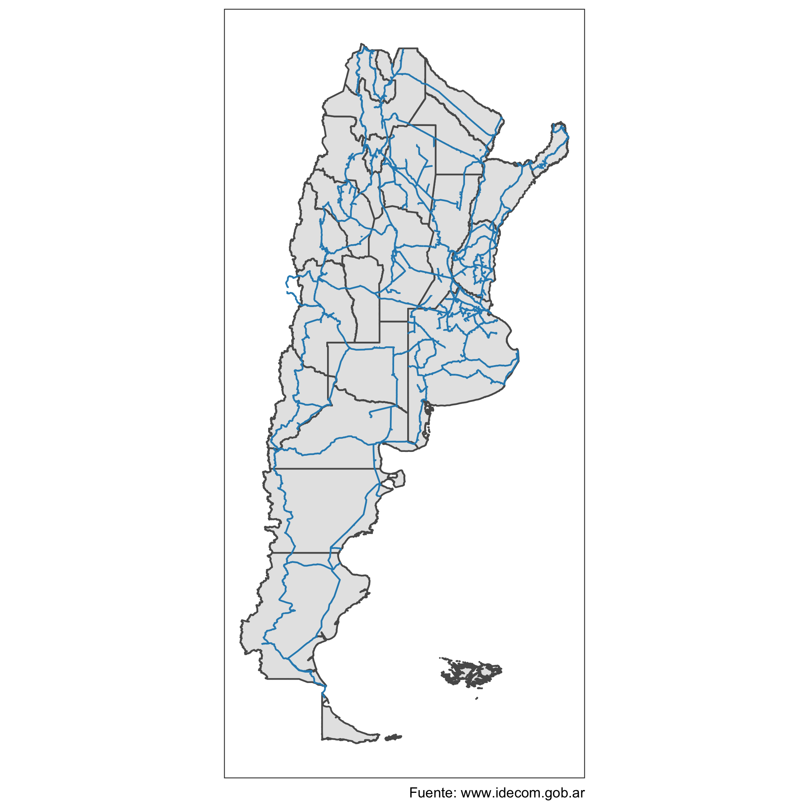

```{r include=FALSE, message=FALSE}
knitr::opts_chunk$set(echo = TRUE, message = FALSE, warning = FALSE)
```

El [#30daymapchallenge][1] es un desafío de mapeo/cartografía/visualización de datos organizado por la comunidad de gente que se dedica a estos temas. La idea es publicar mapas en base a una consigna diaria durante 30 días usando el hashtag [#30daymapchallenge][1].

Estos son los temas diarios para los desafíos de este año:

  

Yo en particular me voy a centrar (los días que pueda publicar) en datos relacionados con TICs, siempre que sea posible.

Empecemos con los desafíos de los días 1 (puntos) y 2 (líneas).

## Día 1 - Puntos

Nodos de conexión a la [Red Federal de Fibra Óptica (REFEFO)][2] de [ARSAT][3].

La REFEFO es una [red troncal de fibra óptica][4]. En los puntos o nodos de conexión los proveedores de internet o ISPs se conectan para llevar internet a los hogares.

```{r, eval=FALSE}
library(tidyverse)
library(sf)
sf_use_s2(FALSE)
library(httr)

provincias_ign <- read_sf("https://wms.ign.gob.ar/geoserver/ows?service=wfs&version=1.1.0&request=GetFeature&typeNames=ign:provincia&outputFormat=application/json")

if(sum(!st_is_valid(provincias_ign)) > 0) {
  provincias_ign <- st_make_valid(provincias_ign)
}

provincias_ign <- st_crop(x = provincias_ign,
                          y = st_bbox(obj = c(xmin=-76.36532,
                                              ymin=-56.75009,
                                              xmax=-51.20850,
                                              ymax=-20.91625)))

nodos_refefo <- read.csv2("https://datos.arsat.com.ar/dataset/8f0b4da0-a40d-4b2b-8fe0-dac06d64152a/resource/15713af0-f384-44c5-8397-c8050162312d/download/puntos-conexion-red-federal-de-fibra-optica-2021-12-01_v1.csv", fileEncoding = "LATIN1")

nodos_refefo <- nodos_refefo %>%
  na.omit() %>%
  st_as_sf(crs = 4326, coords=c("Longitud", "Latitud"), remove=FALSE)

nodos_refefo <- st_crop(x = nodos_refefo,
                        y = st_bbox(obj = c(xmin=-76.36532,
                                            ymin=-56.75009,
                                            xmax=-51.20850,
                                            ymax=-20.91625)))

provincias_ign %>% 
  ggplot() + 
  geom_sf() +
  geom_sf(data = nodos_refefo, color = "#2ca25f", size = 0.5) +
  coord_sf(datum = NA) +
  theme_bw() +
  labs(caption = "Fuente: www.datos.gob.ar")

```
<center>

</center>

## Día 2 - Líneas

Traza de la REFEFO. La fibra óptica de la REFEFO en general va enterrada al lado de rutas nacionales y provinciales, conectando distintas localidades pequeñas y medianas, donde no llegan otros proveedores o hay uno sólo y por lo tanto no se dan condiciones de competencia.

```{r, eval=FALSE}
idecom_base_url <- "https://www.idecom.gob.ar/geoserver/ows"
refefo_query <- list(service="wfs",
                     version="1.3.0",
                     request="GetFeature",
                     typeNames="publico:FO118-TZFO-REDFIBRAOPTICA-5-2",
                     CQL_FILTER="OBSERV='ARSAT - ReFeFO'",
                     outputFormat="application/json")

idecom_url <- modify_url(url = idecom_base_url, 
                         query = refefo_query)

traza_refefo_idecom <- read_sf(idecom_url)

provincias_ign %>% 
  ggplot() +
  geom_sf() +
  geom_sf(data = traza_refefo_idecom, colour="#2b8cbe") +
  coord_sf(datum = NA) +
  theme_bw() +
  labs(caption = "Fuente: www.idecom.gob.ar")

```

<center>

</center>
[1]:https://github.com/tjukanovt/30DayMapChallenge
[2]:https://www.argentina.gob.ar/jefatura/innovacion-publica/ssetic/conectar/refefo/que-es-la-red-federal-de-fibra-optica
[3]:https://www.arsat.com.ar
[4]:https://es.wikipedia.org/wiki/Backbone