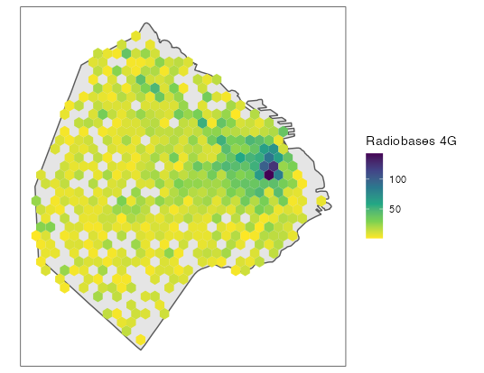

```{r include=FALSE}
knitr::opts_chunk$set(echo = TRUE, message = FALSE, warning = FALSE)
```

## Día 3 - Polígonos

Las celdas de las redes móviles se pueden modelar mediante [Diagramas de Voronoi][3]. Típicamente esto se hace para análisis de movilidad con datos de señalización de los teléfonos celulares, como se muestra en [este paper][5]. 

```{r, eval=FALSE}
library(tidyverse)
library(sf)
library(httr)
library(ggvoronoi)
library(ggmap)

ign_geoserver_base_url <- "https://wms.ign.gob.ar/geoserver/ows"

ign_geoserver_query <- list(service="wfs",
                            version="1.1.0",
                            request="GetFeature",
                            typeNames="ign:departamento",
                            cql_filter="in1='02007'")

ign_geoserver_url <- modify_url(url = ign_geoserver_base_url,
                                query = ign_geoserver_query)

comuna1_sf <- read_sf(ign_geoserver_url)

comuna1_centroid <- st_centroid(comuna1_sf)
comuna1_bbox <- st_bbox(comuna1_sf)

idecom_geoserver_base_url <- "https://www.idecom.gob.ar/geoserver/ows"

idecom_geoserver_query <- list(service="wfs",
                               version="1.3.0",
                               request="GetFeature",
                               typeNames="publico:Antenas103-NO4G-5-3",
                               cql_filter=paste0("BBOX(the_geom,", paste(comuna1_bbox[c(2,1,4,3)], collapse = ","), ")", " AND Banda='7'"))

idecom_geoserver_url <- modify_url(url=idecom_geoserver_base_url, 
                                   query = idecom_geoserver_query)

radiobases_4g_comuna1 <- read_sf(idecom_geoserver_url)

radiobases_4g_comuna1 <- radiobases_4g_comuna1 %>% 
  as_Spatial() %>% 
  sp::remove.duplicates() %>% 
  st_as_sf() %>% 
  na.omit()

register_google(Sys.getenv("GOOGLE_MAPS_API_KEY"))
comuna1_map <- get_googlemap(center = c(lon=-58.37869433449463, 
                                        lat=-34.606838945727), 
                             zoom = 15)

ggmap(comuna1_map, 
      base_layer = ggplot(data = na.omit(st_drop_geometry(radiobases_4g_comuna1)), 
                          aes(Longitud, Latitud))) +
  geom_path(stat = "voronoi", alpha = 0.6, size = 0.4) +
  geom_point(color = "blue", size = 0.7) +
  theme_minimal() +
  theme(axis.text = element_blank(),
        axis.title = element_blank())

```

<center>
{width=75%}
</center>

## Día 4 - Hexágonos

Para graficar las radiobases 4G también se pueden utilizar hexágonos, utilizando la intesidad del color para mostrar la densidad de las mismas.

```{r, eval=FALSE}
library(hexbin)

ign_geoserver_base_url <- "https://wms.ign.gob.ar/geoserver/ows"

ign_geoserver_query <- list(service="wfs",
                            version="1.1.0",
                            request="GetFeature",
                            typeNames="ign:provincia",
                            CQL_FILTER="in1='02'")

ign_geoserver_url <- modify_url(url = ign_geoserver_base_url,
                                query = ign_geoserver_query)
caba <- read_sf(ign_geoserver_url)

caba_bb <- st_bbox(caba)

idecom_geoserver_base_url <- "https://www.idecom.gob.ar/geoserver/ows"

idecom_geoserver_query <- list(service="wfs",
                               version="1.3.0",
                               request="GetFeature",
                               typeNames="publico:Antenas103-NO4G-5-3",
                               cql_filter=paste0("BBOX(the_geom,", paste(caba_bb[c(2,1,4,3)], collapse = ","), ")"))

idecom_geoserver_url <- modify_url(url=idecom_geoserver_base_url, 
                                   query = idecom_geoserver_query)

radiobases_4g_caba <- read_sf(idecom_geoserver_url)

if(st_crs(caba)!=st_crs(radiobases_4g_caba)) {
  radiobases_4g_caba <- st_transform(radiobases_4g_caba, crs = st_crs(caba))
}
radiobases_4g_caba <- st_join(radiobases_4g_caba, caba, left=FALSE)

caba %>% 
  ggplot() +
  geom_sf() +
  geom_hex(data = radiobases_4g_caba, aes(Longitud, Latitud)) +
  theme_bw() +
  coord_sf(datum = NA) +
  scale_fill_viridis_c(direction = -1, name = "Radiobases 4G") +
  theme(axis.title.x = element_blank(),
        axis.title.y = element_blank())

```

<center>

</center>

[3]:https://es.wikipedia.org/wiki/Pol%C3%ADgonos_de_Thiessen
[5]:https://www.researchgate.net/publication/260297863_Mobile_Phone_Location_Area_Based_Traffic_Flow_Estimation_in_Urban_Road_Traffic